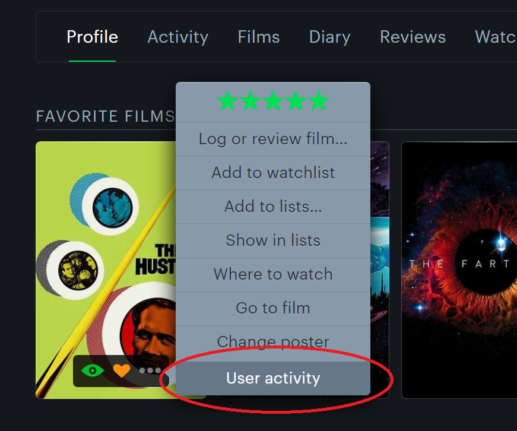

# Letterboxd Expanded - Chrome extension
# By LB user <a href="https://letterboxd.com/QuietVermonter/">QuietVermonter</a>

This is a Chrome extension for letterboxd.com to support customizing my experience on the site. The extension is not active outside of the LB domain.

Release Notes (by version, newest first)

Version 1.0

1) User activity menu link on the film posters '...' menu.

When you are within a user's profile, the film posters '...' menu will have a new option inserted at the bottom of the list. It is called 'User activity' and will forward you to that user's activity feed for that specific film.

Recently LB updated the site and occassionally does send you to the same location when clicking on a film poster, but it is inconsistent. It appears to prioritize sending you to the most recent review of the film for the user. If the user has no reviews, it sometimes directs you to the activity for the film and other times to an empty activity entry. So feels like this extension feature will still be useful, as the menu item guarantees you'll land on the user's activity feed for that film.

List of future potential features:

1) Add the ability to toggle extension features on and off through the extension popup menu.

2) Auto-blocking users based on specific 'follow' criteria. When I visit my own activity feed, if a user has started following me, I want to pull up their activity behind the scenes and determine if they were spam following users in quick succession. If deemed to reach some threshold, automatically report the user for manipulation and block them.

3) Auto-blocking users based on specific 'like' criteria. As with #1, if a user likes a review of mine and isn't a follower, look up their activity and determine if they were spam-liking reviews. If so, automatically report the user for manipulation and block them.

4) Add a subset of films to a list. Ability to select a number of films from any given page, likely a checkbox injected onto the film posters, and upon right-click bring up a menu to add those films to a specific list. Want to investigate whether the existing UI for "Add all films to a list..." can be leveraged to feed a subset of films fed to the function. Currently you can narrow down the list by the available filters, but cannot hand-pick specific films. 

If you have additional suggestions, please leave a comment on the GIT Hub or somewhere on my LB user profile. Thanks!